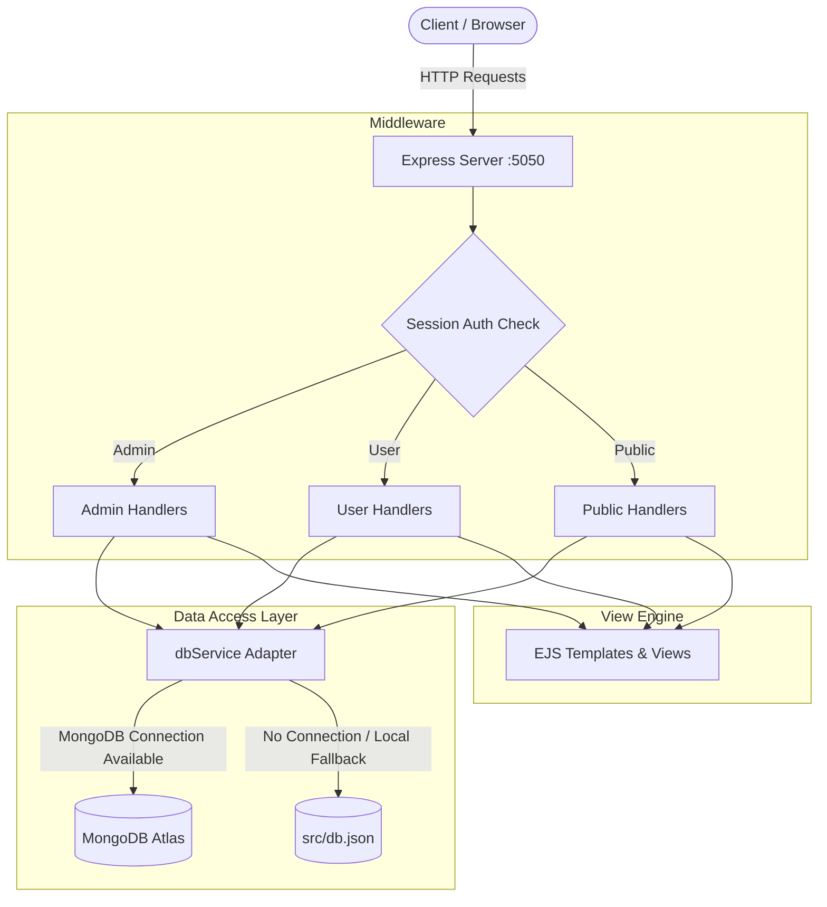

<div align="center">

# 🏨 StayAndaman — Hotel & Vacation Rental Platform

[](https://nodejs.org/)
[](https://expressjs.com/)
[](https://www.mongodb.com/)
[](https://ejs.co/)
[](https://developer.mozilla.org/en-US/docs/Web/CSS)
[](LICENSE)

<p align="center">
  <strong>A full-featured, mobile-responsive accommodation booking & administration web application built with Node.js, Express, EJS, and dual MongoDB/JSON persistence.</strong>
</p>

[Key Features](#-key-features) •
[Architecture](#-system-architecture) •
[Quick Start](#-quick-start) •
[API Reference](#-api-routes-reference) •
[Database Schemas](#-database-models) •
[UI & Mobile Design](#-uiux--mobile-responsive-system)

---

</div>

## 📌 Overview

**StayAndaman** (StayEase) is a modern, production-ready hospitality booking platform designed to connect travelers with curated hotels, cozy lodges, and private vacation rentals. The application provides an intuitive booking flow, real-time price estimation (including adult and child calculations and GST), dynamic PDF receipt generation, and a powerful administrative control center.

### 🌟 Core Highlights

- **Dual-Mode Persistence:** Automatically connects to MongoDB Atlas in production or falls back seamlessly to a local JSON database (`src/db.json`) for zero-configuration local development.
- **Role-Based Portals:** Dedicated experiences for Guests and Administrators with session-based route security.
- **End-to-End Booking Lifecycle:** Property exploration, date pickers, price calculation, status tracking, PDF receipt generation, and self-service cancellations.
- **Full Administrative Control:** Single-page dashboard for property CRUD, booking status workflows, user management, and one-click CSV financial exports.
- **Mobile-First Responsive Design:** Fine-tuned breakpoints (`≤480px`, `≤576px`, `≤768px`) with slide-down drawer navigation, touch targets, and flexible grid layouts.

---

## 🚀 Key Features

### 👤 Guest Experience
| Feature | Details |
| :--- | :--- |
| **Passwordless Authentication** | Fast, frictionless login and registration with credential matching. |
| **Property Categories** | Browse and filter stays across **Hotels**, **Lodges**, and **Rentals**. |
| **Search & Filtering** | Live filtering by keyword, location, pricing, rating, and amenities. |
| **Interactive Detail View** | High-resolution image galleries, room specs, verified reviews, and contact options. |
| **Smart Price Calculator** | Dynamic calculation of base rates, adult/child guest breakdown, 18% GST, and grand total. |
| **Booking Management** | Review active/past trips, trigger instant cancellations, and track status (`Pending`, `Confirmed`, `Cancelled`). |
| **PDF Receipt Generation** | Download branded, client-side PDF booking confirmations and payment receipts powered by jsPDF. |
| **Profile Settings** | Edit user profile details (name, phone, birthdate, city) and upload custom avatars. |

### 🛠️ Administrator Experience
| Feature | Details |
| :--- | :--- |
| **Metrics Dashboard** | Live overview of total revenue, active listings, user count, and booking statuses. |
| **Property Inventory CRUD** | Create, view, edit, and delete accommodation listings with base64 image uploads. |
| **Booking Controls** | Change booking statuses in real time, review guest details, or remove records. |
| **CSV Export** | Export filtered booking lists to formatted CSV spreadsheets with a single click. |
| **User Directory** | View all registered accounts, toggle active/suspended states, or delete profiles. |
| **Security Gating** | Protected admin routes and hidden registration gated behind secure access keys. |

---

## 🏗️ System Architecture

StayAndaman is built on an Express MVC architecture with session-based state management and an abstraction layer for persistent storage:



---

## 📁 Project Structure

```text
StayEase/
├── index.js                  # Application entry point, server setup, & route definitions
├── middleware/
│   ├── isAdminLoggedIn.js    # Guard middleware for admin-only routes
│   └── isUserLoggedIn.js     # Guard middleware for authenticated user routes
├── models/
│   ├── Admin.js              # Admin schema & Mongoose model
│   ├── Booking.js            # Booking reservation schema & Mongoose model
│   ├── Listing.js            # Property accommodation schema & Mongoose model
│   └── User.js               # User profile schema & Mongoose model
├── public/
│   ├── css/
│   │   ├── admin.css         # Single-page admin panel layout & dark theme
│   │   ├── auth.css          # Centered card layouts for login and signup
│   │   ├── booking.css       # Booking modal, step indicators, and pricing summary
│   │   ├── detail.css        # Listing gallery, amenities grid, and review cards
│   │   ├── global.css        # Design tokens (HSL colors, typography, buttons, toasts)
│   │   ├── home.css          # Hero banner, search bar, navbar, and mobile drawer
│   │   ├── landing.css       # Role selector gateway & welcome hero
│   │   ├── listings.css      # Property card grid layouts with hover micro-interactions
│   │   └── profile.css       # Profile manager, avatar preview, and settings forms
│   ├── images/
│   │   ├── logo-primary.svg  # Horizontal SVG logo with CSS shimmer animations
│   │   ├── logo-stacked.svg  # Vertical stacked branding asset
│   │   ├── logo-icon.svg     # Standalone icon mark
│   │   ├── logo-dark.svg     # Dark-mode navbar & sidebar logo
│   │   ├── logo-favicon.svg  # Pixel-perfect 32x32 favicon
│   │   └── hotel_background.png # High-res authentication backdrop
│   └── js/
│       └── admin.js          # Dynamic AJAX logic for admin SPA subpanels
├── src/
│   ├── dbService.js          # Dual database adapter (MongoDB / JSON fallback)
│   └── db.json               # Seed database for local/offline development
├── views/                    # EJS dynamic UI templates
│   ├── adminDashboard.ejs    # Admin control center
│   ├── adminLogin.ejs        # Administrator login
│   ├── adminSignup.ejs       # Admin registration form
│   ├── home.ejs              # Main search & explore page
│   ├── hotels.ejs            # Hotel category filtered listings
│   ├── landing.ejs           # Entry role selector portal
│   ├── listingDetail.ejs     # Detailed property overview & booking modal
│   ├── lodges.ejs            # Lodge category filtered listings
│   ├── myBookings.ejs        # User reservations list & PDF receipt generator
│   ├── rentals.ejs           # Rental category filtered listings
│   ├── userLogin.ejs         # User login form
│   ├── userProfile.ejs       # User account details and avatar editor
│   └── userSignup.ejs        # User registration form
├── .env                      # Environment configuration
├── package.json              # Project metadata & npm dependencies
└── vercel.json               # Vercel deployment configuration
```

---

## ⚡ Quick Start

### Prerequisites
- [Node.js](https://nodejs.org/) (v16.x or higher)
- [npm](https://www.npmjs.com/) (v8.x or higher)
- *Optional:* A free [MongoDB Atlas](https://www.mongodb.com/atlas) connection URI

### 1. Clone & Install

```bash
# Clone the repository
git clone https://github.com/RimiD162/StayEase.git

# Navigate into the project directory
cd StayEase

# Install dependencies
npm install
```

### 2. Configure Environment Variables

Create a `.env` file in the project root:

```env
# Server Port
PORT=5050

# Session Secret Key
SESSION_SECRET=stayease_secure_session_key_2026

# Database Connection (Leave empty or unset to use automatic JSON fallback)
mongodb_url=mongodb+srv://<username>:<password>@cluster0.mongodb.net/StayEase?retryWrites=true&w=majority
```

> **Note:** If `mongodb_url` is omitted or invalid, the app automatically switches to `src/db.json` without any configuration required.

### 3. Run the Application

```bash
# Production mode
npm start

# Development mode (with nodemon hot reloading)
npm run dev
```

Visit the app in your browser at `http://localhost:5050`.

---

## 🌐 API Routes Reference

### Public Routes
| Method | Endpoint | Description |
| :--- | :--- | :--- |
| `GET` | `/` | Portal gateway / Role selection screen |
| `GET` | `/user/login` | User login page |
| `POST` | `/user/login` | Authenticate user credentials and create session |
| `GET` | `/user/signup` | User registration page |
| `POST` | `/user/signup` | Register new user account |
| `GET` | `/admin/login` | Administrator login page |
| `POST` | `/admin/login` | Authenticate admin credentials and create session |
| `GET` | `/admin/signup` | Admin registration page (access code protected) |
| `POST` | `/admin/signup` | Create administrator account |

### Authenticated User Routes (`/middleware/isUserLoggedIn.js`)
| Method | Endpoint | Description |
| :--- | :--- | :--- |
| `GET` | `/home` | Main user exploration dashboard |
| `GET` | `/hotels` / `/home/hotel` | Filtered Hotel accommodations |
| `GET` | `/lodges` / `/home/lodges` | Filtered Lodge accommodations |
| `GET` | `/rentals` / `/home/rentals` | Filtered Vacation Rental accommodations |
| `GET` | `/listing/:id` | Detailed view for a specific property |
| `POST` | `/booking/create` | Submit and confirm a new property reservation |
| `GET` | `/my-bookings` | View user's active, past, and cancelled reservations |
| `POST` | `/booking/cancel/:id` | Cancel an active reservation |
| `GET` | `/profile` | View user profile editor |
| `POST` | `/profile` | Update profile information and avatar image |
| `POST` | `/user/logout` | Terminate user session and clear cookies |

### Protected Admin Routes (`/middleware/isAdminLoggedIn.js`)
| Method | Endpoint | Description |
| :--- | :--- | :--- |
| `GET` | `/admin/dashboard` | Main admin control center |
| `GET` | `/admin/listings` | Render listing management subpanel |
| `GET` | `/admin/users` | Render user management subpanel |
| `GET` | `/admin/bookings` | Render booking management subpanel |
| `GET` | `/admin/profile` | Render admin profile subpanel |
| `GET` | `/api/listings` | Get all listings (JSON) |
| `POST` | `/api/listings` | Create a new listing (JSON) |
| `PUT` | `/api/listings/:id` | Update an existing listing (JSON) |
| `DELETE` | `/api/listings/:id` | Delete a listing (JSON) |
| `GET` | `/api/admin/bookings` | Fetch all system bookings (JSON) |
| `POST` | `/admin/booking/status/:id` | Update lifecycle status of any booking |
| `POST` | `/admin/booking/delete/:id` | Permanently remove a booking record |
| `GET` | `/api/admin/bookings/export` | Export bookings database to CSV format |
| `GET` | `/api/admin/users` | Fetch list of registered users (JSON) |
| `PUT` | `/api/admin/users/:id/toggle`| Toggle user active/suspended state |
| `DELETE` | `/api/admin/users/:id` | Delete user profile |
| `POST` | `/admin/logout` | Terminate admin session |

---

## 🗄️ Database Models

### Listing Model (`models/Listing.js`)
```typescript
{
  name: string;           // Property title
  category: string;       // "Hotel" | "Lodge" | "Rental"
  location: string;       // City, State or Island destination
  price: number;          // Base price per night in INR
  description: string;    // Comprehensive overview of the stay
  amenities: string[];    // ["WiFi", "AC", "Pool", "Parking", "Breakfast", ...]
  rating: number;         // 1 to 5 star rating
  available: boolean;     // Availability status flag
  image: string;          // Primary image URL or base64 data string
  image2?: string;        // Gallery image 2
  image3?: string;        // Gallery image 3
  image4?: string;        // Gallery image 4
  createdAt: Date;        // Timestamp
}
```

### Booking Model (`models/Booking.js`)
```typescript
{
  bookingId: string;       // Unique ID (e.g., "SE-2026-4821")
  listingId: string;       // Reference ID of the booked listing
  listingName: string;     // Property name snapshot
  category: string;        // Category snapshot
  location: string;        // Location snapshot
  listingImage: string;    // Image snapshot for display
  guestName: string;       // Full name of primary guest
  guestEmail: string;      // Guest email address
  guestPhone: string;      // Guest contact phone number
  userId: string;          // User account reference
  checkIn: Date;           // Check-in date
  checkOut: Date;          // Check-out date
  nights: number;          // Total calculated nights
  guests: number;          // Total guest count (Adults + Children)
  roomType: string;        // "Standard" | "Deluxe" | "Suite"
  pricePerNight: number;   // Base daily rate
  subtotal: number;        // Calculated rate * nights
  tax: number;             // 18% GST calculation
  totalAmount: number;     // Grand total payable
  paymentMethod: string;   // "Pay at Property" | "Online"
  specialRequests?: string;// Optional guest requests
  status: string;          // "Confirmed" | "Pending" | "Cancelled"
  createdAt: Date;         // Timestamp
}
```

---

## 🎨 UI/UX & Mobile Responsive System

The application features a modern, bespoke design system with zero external UI framework dependencies:

- **Glassmorphism & Depth:** Soft glass backdrops (`backdrop-filter: blur(12px)`), multi-layered drop shadows, and subtle gradient borders.
- **Color Tokens (HSL):**
  - **Primary Navy:** `#1a1f36` (`hsl(228, 35%, 16%)`)
  - **Warm Gold Accent:** `#f5a623` (`hsl(38, 92%, 55%)`)
  - **Fresh Teal Accent:** `#0abf8a` (`hsl(162, 90%, 39%)`)
- **Responsive Navigation:** Hamburger drawer menu with smooth `slideDrawerDown` keyframe animation for phone viewports.
- **Mobile-Specific Optimization:**
  - Standardized `44px` minimum touch targets for buttons and interactive controls.
  - Inputs with `font-size: 16px` to prevent automatic zoom on iOS devices.
  - Single-column stacked layouts for booking summaries, filter sidebars, and profile managers on screens `<= 480px`.
  - Floating auto-dismiss toast alerts pinned safely to the viewport edges.

---

## 🤝 Contributing

Contributions are welcome! If you'd like to improve StayAndaman:

1. **Fork** the repository
2. **Create** a feature branch: `git checkout -b feature/NewFeature`
3. **Commit** your changes: `git commit -m "feat: add NewFeature"`
4. **Push** to your branch: `git push origin feature/NewFeature`
5. **Open** a Pull Request

---

## 📄 License

This project is open source and available under the [MIT License](LICENSE).
